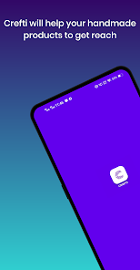
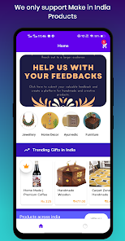

# Crefti - Handmade Products E-Commerce App (Template Code)

Crefti is an E-Commerce app designed for handmade products. It provides a platform for artisans and creators to showcase and sell their unique, handmade items. Built with Java, XML, and Firebase, Crefti offers a seamless and secure shopping experience for users interested in one-of-a-kind, crafted goods.

## Features

- **Product Categories:** Browse a variety of handmade products conveniently categorized for easy navigation.
- **User Authentication:** Secure user accounts with Firebase Authentication ensure a personalized experience.
- **Product Details:** Get detailed information about each product, including images, descriptions, and pricing.
- **Shopping Cart:** Add products to your cart and manage your shopping list effortlessly.
- **Order History:** Keep track of your previous orders and review your purchase history.
- **Real-time Updates:** Firebase Realtime Database ensures that product listings and user data are always up-to-date.

## Screenshots

<table>

  <tr>
    <td> </td>
    <td> </td>
    <td> </td>

  </tr>
 </table>

# App Demo Google PlayStore 

# Configure Firebase 👀
- Create your own project on firebase. 
- download google-services.json 
- Place it in the app folder
- Setup Realtime database in firebase and enable the database by setting true to read & write in the rules tab of relatime database.
- Setup Storage in firebase and enable it by setting true to read and write in the rules of storage. 
- Setup authentication in firebase and enable email/password authentication.
- You are good to go.👌👌

# License
MIT License

Copyright (c) 2022 Rahul

Permission is hereby granted, free of charge, to any person obtaining a copy
of this software and associated documentation files (the "Software"), to deal
in the Software without restriction, including without limitation the rights
to use, copy, modify, merge, publish, distribute, sublicense, and/or sell
copies of the Software, and to permit persons to whom the Software is
furnished to do so, subject to the following conditions:

The above copyright notice and this permission notice shall be included in all
copies or substantial portions of the Software.

THE SOFTWARE IS PROVIDED "AS IS", WITHOUT WARRANTY OF ANY KIND, EXPRESS OR
IMPLIED, INCLUDING BUT NOT LIMITED TO THE WARRANTIES OF MERCHANTABILITY,
FITNESS FOR A PARTICULAR PURPOSE AND NONINFRINGEMENT. IN NO EVENT SHALL THE
AUTHORS OR COPYRIGHT HOLDERS BE LIABLE FOR ANY CLAIM, DAMAGES OR OTHER
LIABILITY, WHETHER IN AN ACTION OF CONTRACT, TORT OR OTHERWISE, ARISING FROM,
OUT OF OR IN CONNECTION WITH THE SOFTWARE OR THE USE OR OTHER DEALINGS IN THE
SOFTWARE.
